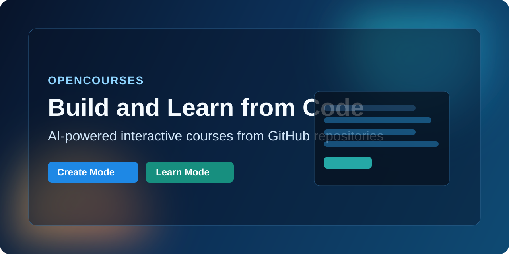

<p align="center">
  
</p>

<h1 align="center">OpenCourses</h1>

<p align="center">
  AI-powered desktop app to create and consume interactive coding courses from GitHub repositories.
</p>

<p align="center">
  <a href="https://github.com/kumarishan/opencourses/stargazers"></a>
  
  
  
  
</p>

## Overview
OpenCourses is a local-first Electron app for two workflows:
- **Create:** point an agent at a source repository and generate structured course content (chapters, sections, tasks, diagrams, examples).
- **Learn:** open a published course, code in a built-in editor + terminal, and get pass/fail feedback from an evaluation agent.

The app runs against your local tooling (`git`, `gh`, `claude`/`codex`) and stores workspace state under `~/.opencourses`.

## Core Features
- AI-assisted course authoring with outline review and iterative updates.
- Interactive learn mode with file tree, Monaco editor, and integrated terminal.
- Agent-based task evaluation with actionable textual feedback.
- Branch-aware create workflow (working branch, push, PR lifecycle).
- Registry-driven course discovery plus direct GitHub URL import.
- Local persistent progress and per-course mode state.

## Architecture Snapshot
- **Renderer (React + Zustand):** screens, panels, and user workflows.
- **Main process (Electron IPC):** orchestrates Git/GitHub, agent execution, filesystem, terminal sessions, and state persistence.
- **Local CLIs:** `git`, `gh`, and one agent CLI (`claude` or `codex`).
- **GitHub:** course repos, PRs/releases, and registry metadata.

## Project Structure
```text
src/
  main/       # Electron main process, services, IPC handlers, state manager
  preload/    # secure renderer bridge
  renderer/   # React UI, views, stores, components
  shared/     # shared IPC contracts and types
resources/
  skills/     # bundled agent skills (course creation / evaluation)
gradient/
  spec.md     # product spec
  hld.md      # high-level design
  lld.md      # low-level design
```

## Prerequisites
Install and authenticate required local tools:
- `git`
- `gh` (and run `gh auth login`)
- one agent CLI: `claude` or `codex`

## Quick Start
```bash
npm install
npm run dev
```

## Testing
```bash
npm test
```

## Local Data
OpenCourses stores local data in:
- `~/.opencourses/state.json` (courses, active mode/branch, progress, agent preference)
- `~/.opencourses/courses/` (local course checkouts)
- `~/.opencourses/logs/` (app logs)

## Typical Flow
1. Add a course from registry, direct GitHub URL, or create path.
2. Switch between **Learn** and **Create** mode per course.
3. In Create mode, generate or refine content with the agent and push PRs.
4. In Learn mode, complete tasks in scratch files and submit for evaluation.

## License
MIT
