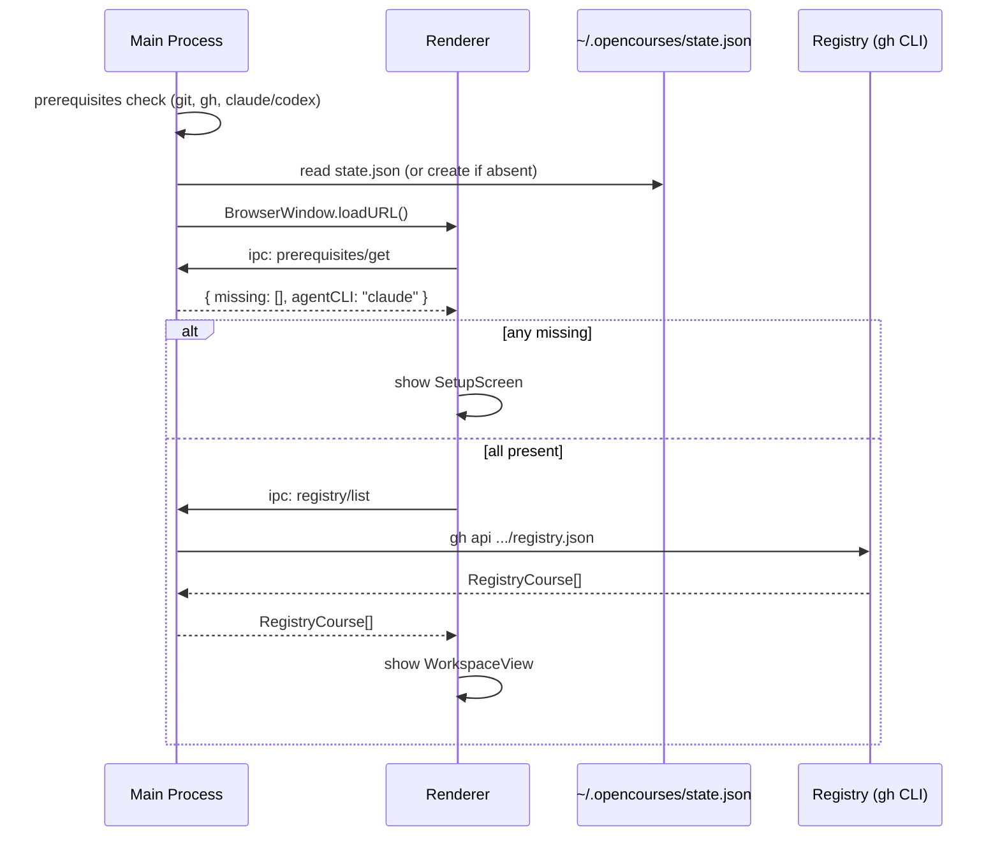
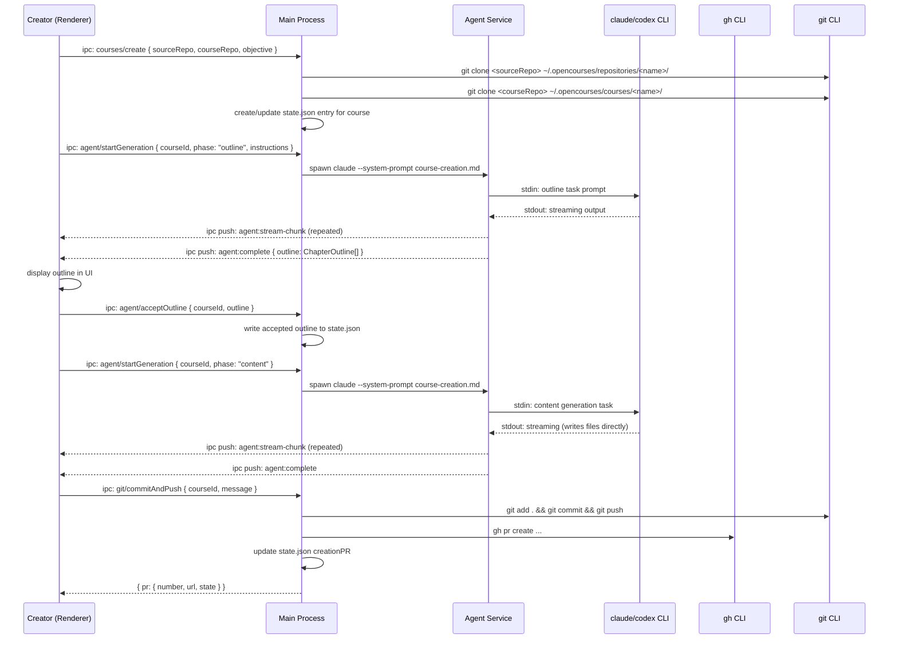
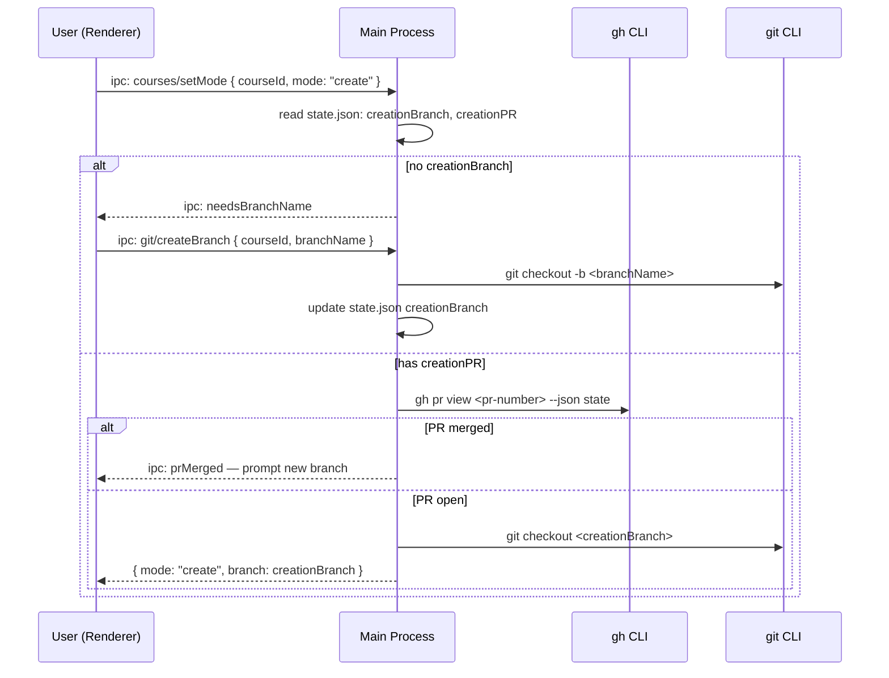

# High-Level Technical Spec: opencourses

**Project:** opencourses
**Date:** 2026-03-29
**PRD:** ade/opencourses/specs/prd.md

---

## Summary

opencourses is a greenfield Electron desktop application (macOS-first) that enables AI-assisted course creation from GitHub repositories and interactive course consumption with AI-powered evaluation. All persistent state lives in `~/.opencourses/` on the user's local machine — there is no server, no cloud sync, and no in-app authentication flow.

The application is organized around two primary user modes: **Create mode**, where an AI agent (Claude Code CLI or Codex CLI subprocess) analyzes a source GitHub repository and generates structured Markdown course content into a dedicated course repo; and **Learn mode**, where learners step through sections, write code in a Monaco editor and terminal, and have their work evaluated by the same AI agent runtime using a different skill/system prompt. Mode state, progress, and branch metadata are tracked in a single `~/.opencourses/state.json` file.

The only external dependencies are CLI tools the user must pre-install (`git`, `gh`, `claude` or `codex`). All GitHub API interactions go through the `gh` CLI subprocess; all Git operations go through the `git` CLI subprocess. The app bundles Monaco Editor for code editing in the Create mode left column, Lexical for section content rendering (read-only in Learn mode, editable in Create mode), `node-pty` for the embedded terminal, and Mermaid/Lottie/Excalidraw as custom Lexical nodes. The public course registry is a plain GitHub repository read via `gh` on startup.

---

## Architecture Diagram

```mermaid
graph TD
  subgraph Electron Main Process
    A[App Bootstrap] --> B[Prerequisites Check]
    B --> C[State Manager]
    C --> D[IPC Handler Layer]
    D --> E[Git Service]
    D --> F[GitHub Service - gh CLI]
    D --> G[Agent Service]
    D --> H[Registry Service]
    D --> I[Terminal Service - node-pty]
    D --> J[File System Service]
  end

  subgraph Electron Renderer Process
    K[React App] --> L[Top Navbar]
    K --> M[Left Sidebar - Course Tree]
    K --> N[Main Content Area]
    N --> O[Learn Mode Layout]
    N --> P[Create Mode Layout]
    O --> Q[File Tree + Monaco + Terminal]
    O --> R[Section Renderer]
    P --> S[Agent Chat Panel]
    P --> T[Terminal Panel - xterm.js]
    P --> U[Section Preview Panel]
  end

  D <-->|contextBridge IPC| K
  G -->|subprocess stdin/stdout| V[claude / codex CLI]
  E -->|subprocess| W[git CLI]
  F -->|subprocess| X[gh CLI]
  I -->|node-pty| Y[Local Shell]

  subgraph Local Filesystem ~/.opencourses
    Z1[repositories/ - cloned source repos]
    Z2[courses/ - course repos + scratch/]
    Z3[state.json]
  end

  C --> Z3
  E --> Z1
  E --> Z2
  J --> Z2
```

---

## Component Responsibilities

### opencourses (single Electron repo)

This is the only repository in the project. All implementation lives here.

#### Electron Main Process

- **App Bootstrap (`src/main/bootstrap.ts`)**
  - Entry point; creates the BrowserWindow; loads the renderer.
  - Runs prerequisites check before the main window is ready.
  - Initializes State Manager from `~/.opencourses/state.json`.

- **Prerequisites Check (`src/main/services/prerequisites.ts`)**
  - Detects `git`, `gh`, `claude`, `codex` via `which`/`where` subprocess calls.
  - Returns a structured result (present/absent per tool).
  - Sends result to renderer via IPC; renderer shows setup screen if any tool is missing.
  - Re-runs on each app startup; not cached.

- **State Manager (`src/main/state/stateManager.ts`)**
  - Owns all reads and writes to `~/.opencourses/state.json`.
  - Exposes typed get/set methods; debounced disk writes.
  - Loaded fully on startup; held in memory; persisted on change.

- **IPC Handler Layer (`src/main/ipc/`)**
  - All Electron `ipcMain.handle()` registrations live here, grouped by domain:
    - `ipc/courses.ts` — course CRUD, state queries
    - `ipc/agent.ts` — agent invocation, streaming output
    - `ipc/git.ts` — git operations
    - `ipc/github.ts` — gh CLI operations
    - `ipc/registry.ts` — registry fetch + parse
    - `ipc/terminal.ts` — terminal session management
    - `ipc/fs.ts` — file read/write for course files and scratch
  - Each handler validates its input, calls the appropriate service, and returns a typed response or throws a structured error.

- **Git Service (`src/main/services/git.ts`)**
  - Wraps `git` CLI subprocess calls.
  - Operations: `clone`, `checkout`, `createBranch`, `commit`, `push`, `status`, `log`, `listBranches`, `currentBranch`, `discardChanges`.
  - Working directory passed per-call (no global state).
  - Parses stdout/stderr into typed results.

- **GitHub Service (`src/main/services/github.ts`)**
  - Wraps `gh` CLI subprocess calls.
  - Operations: `createPR`, `getPRState`, `createRelease`, `listReleases`, `repoExists`, `createRepo`, `submitRegistryPR`.
  - Returns typed results; propagates `gh` errors as structured exceptions.

- **Agent Service (`src/main/services/agent.ts`)**
  - Spawns `claude` or `codex` CLI as a child process with `node:child_process.spawn`.
  - Accepts: working directory, skill definition (string), task prompt, any file context.
  - Streams stdout line-by-line to the renderer via IPC push events (`agent:stream-chunk`).
  - Emits `agent:complete` or `agent:error` when the process exits.
  - Supports cancellation via `SIGINT` to the subprocess.
  - Selects CLI based on what was found during prerequisites check (preference: `claude` > `codex`).

- **Registry Service (`src/main/services/registry.ts`)**
  - Runs `gh api` or `gh repo clone` (depending on registry format) to fetch the public registry repo contents at startup.
  - Parses the registry index file into a typed `RegistryCourse[]` array.
  - Caches the result in memory for the session; provides a `refresh()` method.

- **Terminal Service (`src/main/services/terminal.ts`)**
  - Creates and manages `node-pty` pseudo-terminal sessions.
  - Each session is identified by a `sessionId`.
  - Forwards pty output to the renderer via IPC push events (`terminal:data:<sessionId>`).
  - Accepts resize and input events from the renderer.
  - Default working directory: course scratch directory.

- **File System Service (`src/main/services/fs.ts`)**
  - Safe read/write/list operations scoped to `~/.opencourses/`.
  - Used by the renderer to read course Markdown files and write scratch files.
  - Provides directory watch events (via `fs.watch`) forwarded over IPC for live preview updates.

#### Electron Renderer Process (React)

- **React App Entry (`src/renderer/app.tsx`)**
  - Sets up **React Router** (`react-router-dom`) with the following routes:
    ```
    /                          → redirect to /setup or workspace
    /setup                     → SetupScreen (prerequisites not met)
    /courses/:name             → CourseView (renders LearnMode or CreateMode based on store)
    ```
  - Sidebar and TopNavbar are rendered outside the route outlet — they persist across navigation.
  - Learn/Create mode is held in `CourseStore` (Zustand), not in the URL. The mode selector in the navbar updates the store; `CourseView` reads the mode and renders the appropriate layout.

- **App State (`src/renderer/store/`)** — React Context + `useReducer` (or Zustand) stores shared across all components to avoid prop drilling:
  - `CourseStore` — active course name, active chapter/section, mode (learn/create), branch.
  - `AgentStore` — agent job state, streamed output chunks, completion status.
  - `TerminalStore` — terminal session IDs and connection state.
  - Components read from the store via hooks (`useCourse()`, `useAgent()`, etc.); only leaf components that need dispatch receive it. No prop threading through intermediate layout components.

- **IPC Client (`src/renderer/ipc/client.ts`)**
  - Typed wrappers around `window.electron.invoke()` (contextBridge).
  - Mirrors the IPC handler domains; exports typed async functions.
  - Provides a `subscribe()` helper for push events (agent stream, terminal data).

- **Top Navbar (`src/renderer/components/TopNavbar.tsx`)**
  - Breadcrumb (course > chapter, derived from current section state).
  - Mode-dependent action buttons (sourced from current mode's action registry).
  - Branch selector dropdown — calls `git.listBranches` + `git.checkout` via IPC.
  - Mode selector dropdown — updates `state.json` activeMode for the current course.

- **Left Sidebar — Course Tree (`src/renderer/components/Sidebar.tsx`)**
  - Single CTA at the top: **+ Add Course** — opens the Add Course modal with three options:
    - **Registry browser** — searchable list of courses fetched from the public registry; user picks one to add locally.
    - **Create new** — starts the New Course flow (select source repo, enter objective, launch agent to generate a course).
    - **GitHub URL** — paste a course repo URL directly to add it without going through the registry.
  - Below CTAs: renders the course list from `state.json`; each course expands into chapters/sections derived from the course's `course.json` + `chapters/` directory listing.
  - Completion status per section/chapter rendered from learner progress in state.
  - Click navigates to section and updates active section in state.

- **Learn Mode Layout (`src/renderer/views/LearnMode.tsx`)**
  - Two columns: `FileTreePanel` + `CodeEditorPanel` + `TerminalPanel` stacked (left) + `SectionRenderer` (right).
  - Left column is the hands-on coding environment: learner writes code in Monaco and runs commands in the terminal while following the section content on the right.

- **Agent Chat Panel (`src/renderer/components/AgentChatPanel.tsx`)**
  - Chat UI for interacting with the AI agent (course generation and updates).
  - Sends user messages to Agent Service via IPC.
  - Streams agent responses (line-by-line IPC push events) into the chat history.
  - Used in Create mode only.

- **Section Renderer (`src/renderer/components/SectionRenderer.tsx`)**
  - Renders section content using **Lexical** as the editor/renderer framework.
  - In **Learn mode**: Lexical is mounted in read-only mode — content is displayed but not editable.
  - In **Create mode**: Lexical is mounted in editable mode — the user can directly edit section content in-place; changes are persisted back to the section Markdown file via IPC fs.write.
  - Custom Lexical nodes handle rich content embedded in sections:
    - **MermaidNode** — renders Mermaid diagram blocks via `mermaid.js`.
    - **LottieNode** — plays Lottie JSON animations via `lottie-web`.
    - **ExcalidrawNode** — embeds Excalidraw scene viewer for `.excalidraw` references.
    - **TaskBlockNode** — renders structured task block UI (instructions, hints, submit button).
  - Receives file content via IPC on section open; re-renders on file watch events (Learn mode) or on Lexical state change (Create mode).

- **Create Mode Layout (`src/renderer/views/CreateMode.tsx`)**
  - Two columns: `AgentChatPanel` (left) + `SectionRenderer` (right).
  - Creator chats with the AI agent on the left to generate or update course content; sees the rendered result on the right.

- **File Tree Panel (`src/renderer/components/FileTreePanel.tsx`)**
  - Shows directory tree rooted at the course scratch directory (or configured alternative).
  - File click opens file in Monaco.

- **Code Editor Panel (`src/renderer/components/CodeEditorPanel.tsx`)**
  - `@monaco-editor/react` wrapper.
  - Saves to scratch dir (or course dir for creator editing section content) via IPC fs.write.
  - Triggers live preview update via IPC file watch events.

- **Terminal Panel (`src/renderer/components/TerminalPanel.tsx`)**
  - `xterm.js` renderer connected to a `node-pty` session via IPC.
  - Forwards input keypresses; receives and renders output data.

- **Add Course Modal (`src/renderer/components/AddCourseModal.tsx`)**
  - Opened by the **+ Add Course** CTA in the sidebar.
  - Three tabs:
    - **Registry** — fetches courses via `registry.list()` IPC; searchable by title/tag/objective; selecting one clones it locally and registers it in state.
    - **Create New** — form to enter source repo URL and learning objective; on submit launches the agent generation flow in Create mode.
    - **GitHub URL** — paste a course repo URL directly; clones and registers it in state without going through the registry.

- **Setup Screen (`src/renderer/views/SetupScreen.tsx`)**
  - Shown when prerequisites check fails.
  - Lists missing tools with per-tool install instructions.
  - "Re-check" button re-runs prerequisites check.

---

## Data Models

### Course on Disk (`~/.opencourses/courses/<course-name>/`)

```
course.json                         # course-level metadata
chapters/
  01-<slug>/
    chapter.json                    # chapter metadata
    sections/
      01-<slug>.md                  # section content (Markdown + extensions)
      02-<slug>.md
assets/                             # images, Lottie JSONs, Excalidraw files
scratch/                            # gitignored learner work dir (default location)
.gitignore                          # must include /scratch/ at minimum
```

**`course.json` schema:**
```json
{
  "id": "string (uuid)",
  "title": "string",
  "description": "string",
  "objective": "free text description of what learners should get out of the course",
  "version": "string (semver, e.g. 1.0.0)",
  "sourceRepo": "string (GitHub URL)",
  "courseRepo": "string (GitHub URL)",
  "registryEntry": {
    "title": "string",
    "description": "string",
    "tags": ["string"]
  },
  "createdAt": "string (ISO 8601)",
  "updatedAt": "string (ISO 8601)"
}
```

**`chapter.json` schema:**
```json
{
  "id": "string (uuid)",
  "title": "string",
  "description": "string",
  "order": "number"
}
```

**Section Markdown frontmatter (YAML):**
```yaml
---
id: "string (uuid)"
title: "string"
order: 1
hasTask: true
---
```

**Task block (fenced block in Markdown body):**
```
:::task
id: task-01
title: "Implement the parseConfig function"
objective: "Write a function that reads a JSON config file and returns a typed object."
hints:
  - "Use fs.readFileSync"
  - "Use JSON.parse"
criteria:
  - "File config.ts exists in the scratch directory"
  - "parseConfig('config.json') returns an object with a 'name' field"
:::
```

### `~/.opencourses/state.json` schema

```json
{
  "version": 1,
  "agentPreference": "claude | codex | null",
  "courses": {
    "<course-id>": {
      "id": "string",
      "name": "string (slug)",
      "title": "string",
      "localPath": "string (absolute path to course dir)",
      "scratchPath": "string (absolute path to scratch dir)",
      "sourceRepo": "string (GitHub URL)",
      "courseRepo": "string (GitHub URL)",
      "activeMode": "learn | create",
      "activeBranch": "string (git branch name)",
      "creationBranch": "string | null (active creation branch)",
      "creationPR": {
        "number": "number | null",
        "url": "string | null",
        "state": "open | merged | closed | null"
      },
      "activeSection": {
        "chapterId": "string",
        "sectionFile": "string (filename)"
      } ,
      "learnerProgress": {
        "<chapter-id>": {
          "completed": "boolean",
          "sections": {
            "<section-file>": {
              "completed": "boolean",
              "completedAt": "string (ISO 8601) | null"
            }
          }
        }
      },
      "addedAt": "string (ISO 8601)"
    }
  }
}
```

### Registry Format

The public registry GitHub repo contains a single index file:

**`registry.json` (at registry repo root):**
```json
{
  "version": 1,
  "courses": [
    {
      "id": "string (uuid)",
      "title": "string",
      "description": "string",
      "tags": ["string"],
      "objective": "free text description of what learners should get out of the course",
      "courseRepo": "string (GitHub URL)",
      "authorGitHub": "string",
      "latestVersion": "string (semver)",
      "publishedAt": "string (ISO 8601)",
      "updatedAt": "string (ISO 8601)"
    }
  ]
}
```

The app fetches this file at startup using:
```
gh api repos/<owner>/opencourses-registry/contents/registry.json --jq '.content' | base64 -d
```

### Agent Skill Definitions (bundled with app)

Skills follow the **standard Claude Code skill design** — each is a directory with a `SKILL.md` file (YAML frontmatter + Markdown body) and optional `references/` subdirectory. They are bundled inside the Electron app package at `resources/skills/`:

```
resources/skills/
  course-creation/
    SKILL.md                  # frontmatter: name, description + full creation instructions
    references/
      course-format.md        # course directory layout, section Markdown format, task block spec
  course-evaluation/
    SKILL.md                  # frontmatter: name, description + evaluation instructions
    references/
      evaluation-criteria.md  # how to assess learner work, pass/fail criteria, feedback format
```

**`SKILL.md` frontmatter structure (standard):**
```yaml
---
name: course-creation          # kebab-case skill identifier
description: >                 # what the skill does + when to invoke it
  Generates a structured hands-on course from a GitHub repository.
  Use this skill when creating or updating a course in opencourses...
---
```

The body of each `SKILL.md` contains step-by-step instructions for the agent (outline phase, content generation phase, file structure to produce, etc.). Supporting specs (course format, task block syntax) live in `references/` and are referenced from the body rather than inlined.

The Agent Service reads the `SKILL.md` and any referenced files from disk and passes them to the CLI subprocess as the skill/system prompt at invocation time.

---

## Key Technology Choices

### 1. Electron (with contextBridge + preload)

**Decision:** Use Electron with strict context isolation — all Node.js/OS access lives in the main process; the renderer communicates only via `ipcRenderer.invoke()` through a typed `contextBridge` preload script.

**Rationale:** macOS-first desktop app requirement. Context isolation is enforced from the start to prevent renderer XSS from gaining Node.js access. The preload script is the sole surface area between untrusted content (rendered Markdown, Monaco) and the OS.

**Alternative considered:** Tauri (Rust backend). Rejected because the team is JS/TS-native and the `node-pty` / subprocess management ecosystem is more mature in Node.

### 2. TypeScript end-to-end (main + renderer)

**Decision:** Single `tsconfig` setup with path aliases; shared types in `src/shared/types/`.

**Rationale:** IPC contracts between main and renderer must be type-safe. Sharing `CourseState`, `AgentEvent`, `IpcChannels` types in a `shared/` package eliminates an entire class of runtime errors without needing a separate package.

### 3. React + Vite (renderer)

**Decision:** Vite for renderer bundling; React for UI.

**Rationale:** Vite's HMR significantly accelerates development iteration. React's component model maps naturally to the panel-based layout. No need for a heavier framework (Next.js has no value in a desktop app without SSR).

### 4. CLI subprocess for all external tool interaction

**Decision:** `git`, `gh`, `claude`, `codex` are all invoked as child processes via `node:child_process.spawn`. No Git library (e.g., `isomorphic-git`, `nodegit`) or GitHub SDK is used.

**Rationale:**
- Respects the user's pre-existing `gh auth` and `git` credential configurations without any re-implementation.
- `claude`/`codex` CLIs have no stable programmatic Node.js API; subprocess is the only option.
- `gh` CLI handles GitHub auth, rate limiting, and API versioning transparently.
- Trade-off: subprocess parsing is more brittle than a native library, but the simplicity and auth delegation outweigh this for v1.

### 5. `node-pty` + `xterm.js` for the embedded terminal

**Decision:** `node-pty` in the main process spawns a real pseudo-terminal; `xterm.js` in the renderer renders it. IPC bridges the two.

**Rationale:** Industry-standard approach (used by VS Code, Hyper, etc.). Full VT100/ANSI support without re-implementation. `node-pty` must be rebuilt for each Electron version — this is a known maintenance cost.

### 6. Monaco Editor via `@monaco-editor/react`

**Decision:** Embed Monaco using the official React wrapper.

**Rationale:** The PRD specifies Monaco explicitly. The React wrapper handles lazy loading and worker setup. Same editor used by VS Code means familiar UX for developers.

---

## Inter-Component Data Flow

### Flow 1: App Startup



### Flow 2: Course Generation (Create Mode)



### Flow 3: Learning Agent Evaluation

```mermaid
sequenceDiagram
  participant L as Learner (Renderer)
  participant M as Main Process
  participant AG as Agent Service
  participant CLI as claude/codex CLI
  participant FS as Scratch Directory

  L->>M: ipc: agent/evaluate { courseId, sectionFile, taskBlock }
  M->>FS: read relevant scratch files (per task criteria)
  M->>AG: spawn claude --system-prompt course-evaluation.md
  AG->>CLI: stdin: { taskBlock, fileContents, terminalOutput }
  CLI-->>AG: stdout: { pass: bool, feedback: string }
  AG-->>L: ipc push: agent:evaluation-result { pass, feedback }
  alt pass == true
    M->>M: state.json: mark section complete
    M-->>L: ipc push: progress/updated { sectionFile, completed: true }
    L->>L: unlock next section
  else pass == false
    L->>L: display feedback; allow resubmit
  end
```

### Flow 4: Branch Management on Mode Switch



---

## API Contracts (IPC Channels)

All IPC is typed in `src/shared/ipc.ts`. Channels use the pattern `<domain>/<action>`.

### Prerequisites

| Channel | Direction | Request | Response |
|---|---|---|---|
| `prerequisites/get` | invoke | `{}` | `{ missing: ToolName[], agentCLI: 'claude' \| 'codex' \| null }` |

### Registry

| Channel | Direction | Request | Response |
|---|---|---|---|
| `registry/list` | invoke | `{}` | `RegistryCourse[]` |
| `registry/refresh` | invoke | `{}` | `RegistryCourse[]` |

### Courses

| Channel | Direction | Request | Response |
|---|---|---|---|
| `courses/list` | invoke | `{}` | `CourseState[]` |
| `courses/add` | invoke | `AddCourseRequest` | `CourseState` |
| `courses/remove` | invoke | `{ courseId: string }` | `void` |
| `courses/setMode` | invoke | `{ courseId: string, mode: Mode }` | `ModeSetResult` |
| `courses/getProgress` | invoke | `{ courseId: string }` | `LearnerProgress` |

### Git

| Channel | Direction | Request | Response |
|---|---|---|---|
| `git/clone` | invoke | `{ url: string, dest: string }` | `void` |
| `git/listBranches` | invoke | `{ courseId: string }` | `string[]` |
| `git/createBranch` | invoke | `{ courseId: string, name: string }` | `void` |
| `git/checkout` | invoke | `{ courseId: string, branch: string }` | `void` |
| `git/commitAndPush` | invoke | `{ courseId: string, message: string }` | `void` |
| `git/discard` | invoke | `{ courseId: string }` | `void` |
| `git/status` | invoke | `{ courseId: string }` | `GitStatus` |

### GitHub

| Channel | Direction | Request | Response |
|---|---|---|---|
| `github/createPR` | invoke | `CreatePRRequest` | `PRInfo` |
| `github/getPRState` | invoke | `{ courseId: string, prNumber: number }` | `PRState` |
| `github/createRelease` | invoke | `CreateReleaseRequest` | `ReleaseInfo` |
| `github/submitRegistryPR` | invoke | `{ courseId: string }` | `PRInfo` |

### Agent

| Channel | Direction | Request | Response |
|---|---|---|---|
| `agent/startGeneration` | invoke | `AgentGenerationRequest` | `{ jobId: string }` |
| `agent/evaluate` | invoke | `AgentEvaluationRequest` | `{ jobId: string }` |
| `agent/cancel` | invoke | `{ jobId: string }` | `void` |
| `agent:stream-chunk` | push (main→renderer) | `{ jobId: string, chunk: string }` | — |
| `agent:complete` | push (main→renderer) | `AgentCompleteEvent` | — |
| `agent:error` | push (main→renderer) | `{ jobId: string, error: string }` | — |
| `agent:evaluation-result` | push (main→renderer) | `EvaluationResult` | — |

### Terminal

| Channel | Direction | Request | Response |
|---|---|---|---|
| `terminal/create` | invoke | `{ courseId: string, cwd?: string }` | `{ sessionId: string }` |
| `terminal/input` | invoke | `{ sessionId: string, data: string }` | `void` |
| `terminal/resize` | invoke | `{ sessionId: string, cols: number, rows: number }` | `void` |
| `terminal/destroy` | invoke | `{ sessionId: string }` | `void` |
| `terminal:data` | push (main→renderer) | `{ sessionId: string, data: string }` | — |

### File System

| Channel | Direction | Request | Response |
|---|---|---|---|
| `fs/read` | invoke | `{ path: string }` | `{ content: string }` |
| `fs/write` | invoke | `{ path: string, content: string }` | `void` |
| `fs/list` | invoke | `{ path: string }` | `FSEntry[]` |
| `fs/watch` | invoke | `{ path: string }` | `{ watchId: string }` |
| `fs/unwatch` | invoke | `{ watchId: string }` | `void` |
| `fs:changed` | push (main→renderer) | `{ watchId: string, path: string }` | — |

---

## Shared TypeScript Types (`src/shared/types/`)

```typescript
// src/shared/types/course.ts
// objective is free text — no enum constraint
type ModeType = 'learn' | 'create';

interface CourseMetadata {
  id: string;
  title: string;
  description: string;
  objective: string;
  version: string;
  sourceRepo: string;
  courseRepo: string;
  registryEntry: { title: string; description: string; tags: string[] };
  createdAt: string;
  updatedAt: string;
}

interface ChapterMetadata {
  id: string;
  title: string;
  description: string;
  order: number;
}

interface SectionFrontmatter {
  id: string;
  title: string;
  order: number;
  hasTask: boolean;
}

interface TaskBlock {
  id: string;
  title: string;
  objective: string;
  hints: string[];
  criteria: string[];
}

// src/shared/types/state.ts
interface SectionProgress {
  completed: boolean;
  completedAt: string | null;
}

interface ChapterProgress {
  completed: boolean;
  sections: Record<string, SectionProgress>;
}

interface PRInfo {
  number: number | null;
  url: string | null;
  state: 'open' | 'merged' | 'closed' | null;
}

interface CourseState {
  id: string;
  name: string;
  title: string;
  localPath: string;
  scratchPath: string;
  sourceRepo: string;
  courseRepo: string;
  activeMode: ModeType;
  activeBranch: string;
  creationBranch: string | null;
  creationPR: PRInfo;
  activeSection: { chapterId: string; sectionFile: string } | null;
  learnerProgress: Record<string, ChapterProgress>;
  addedAt: string;
}

interface AppState {
  version: number;
  agentPreference: 'claude' | 'codex' | null;
  courses: Record<string, CourseState>;
}

// src/shared/types/registry.ts
interface RegistryCourse {
  id: string;
  title: string;
  description: string;
  tags: string[];
  objective: string;
  courseRepo: string;
  authorGitHub: string;
  latestVersion: string;
  publishedAt: string;
  updatedAt: string;
}

// src/shared/types/agent.ts
interface AgentGenerationRequest {
  courseId: string;
  phase: 'outline' | 'content' | 'section-update';
  targetChapter?: string;
  targetSection?: string;
  instructions?: string;
}

interface AgentEvaluationRequest {
  courseId: string;
  sectionFile: string;
  taskBlock: TaskBlock;
  scratchFiles: Array<{ path: string; content: string }>;
  terminalOutput?: string;
}

interface AgentCompleteEvent {
  jobId: string;
  phase: string;
  outline?: ChapterOutline[];
}

interface EvaluationResult {
  jobId: string;
  pass: boolean;
  feedback: string;
}

interface ChapterOutline {
  title: string;
  description: string;
  sections: Array<{ title: string; description: string; hasTask: boolean }>;
}
```

---

## Cross-Cutting Concerns

### Auth

No in-app authentication. All GitHub operations assume `gh auth login` has been run by the user outside the app. The `gh` CLI subprocess transparently uses the stored credentials from the user's keychain. The app never reads, stores, or transmits GitHub tokens.

### Observability

- All subprocess invocations (git, gh, claude, codex) log their full command, working directory, stdout, stderr, and exit code at debug level to the Electron main process log file (`~/.opencourses/logs/main.log`).
- IPC handler invocations log channel name, request shape (sanitized), and response time.
- Agent stream chunks are logged at trace level only when a `--verbose` flag is passed on app startup.
- No telemetry is collected or transmitted.

### Error Handling

- IPC handlers catch all exceptions and return a typed `{ error: { code: string, message: string } }` structure rather than throwing across the IPC boundary.
- The renderer's IPC client wraps all invokes in a common error handler that extracts this structure and throws typed `IPCError` instances.
- Subprocess failures surface via `stderr` content and non-zero exit codes — parsed into domain-specific error codes (e.g., `GIT_CLONE_FAILED`, `GH_AUTH_MISSING`, `AGENT_TIMEOUT`).
- Agent subprocess errors (non-zero exit) trigger `agent:error` push events; the renderer shows an inline error in the chat/generation panel without crashing the session.

### Security

- Context isolation is enabled; `nodeIntegration` is `false` in the renderer.
- The preload script exposes only the typed `window.electron` API — no raw `ipcRenderer` or `require` is exposed.
- File system operations in the FS Service are path-scoped: all paths are resolved and checked to be within `~/.opencourses/` before any read/write (path traversal prevention).
- The agent subprocess runs with the user's own OS privileges — no sandboxing beyond what the OS provides.

---

## Project Structure

```
opencourses/
├── src/
│   ├── main/
│   │   ├── index.ts                  # Electron main entry
│   │   ├── bootstrap.ts              # window creation, startup sequence
│   │   ├── preload.ts                # contextBridge definitions
│   │   ├── ipc/
│   │   │   ├── courses.ts
│   │   │   ├── agent.ts
│   │   │   ├── git.ts
│   │   │   ├── github.ts
│   │   │   ├── registry.ts
│   │   │   ├── terminal.ts
│   │   │   └── fs.ts
│   │   ├── services/
│   │   │   ├── prerequisites.ts
│   │   │   ├── git.ts
│   │   │   ├── github.ts
│   │   │   ├── agent.ts
│   │   │   ├── registry.ts
│   │   │   ├── terminal.ts
│   │   │   └── fs.ts
│   │   └── state/
│   │       └── stateManager.ts
│   ├── renderer/
│   │   ├── app.tsx                   # React Router setup, root layout
│   │   ├── ipc/
│   │   │   └── client.ts
│   │   ├── store/                    # shared state — no prop drilling
│   │   │   ├── courseStore.ts        # active course, section, mode, branch
│   │   │   ├── agentStore.ts         # agent job state + stream chunks
│   │   │   └── terminalStore.ts      # terminal session state
│   │   ├── views/
│   │   │   ├── SetupScreen.tsx       # route: /setup
│   │   │   ├── WorkspaceView.tsx     # root layout: Sidebar + Navbar + outlet
│   │   │   ├── CourseView.tsx        # route: /courses/:name — renders LearnMode or CreateMode from store
│   │   │   ├── LearnMode.tsx         # layout component (no route)
│   │   │   └── CreateMode.tsx        # layout component (no route)
│   │   └── components/
│   │       ├── TopNavbar.tsx
│   │       ├── Sidebar.tsx
│   │       ├── AddCourseModal.tsx
│   │       ├── AgentChatPanel.tsx
│   │       ├── SectionRenderer.tsx
│   │       ├── FileTreePanel.tsx
│   │       ├── CodeEditorPanel.tsx
│   │       └── TerminalPanel.tsx
│   └── shared/
│       ├── ipc.ts                    # IPC channel name constants + request/response types
│       └── types/
│           ├── course.ts
│           ├── state.ts
│           ├── registry.ts
│           └── agent.ts
├── resources/
│   └── skills/
│       ├── course-creation/
│       │   ├── SKILL.md                   # standard skill: name, description, creation instructions
│       │   └── references/
│       │       └── course-format.md       # course dir layout, section format, task block spec
│       └── course-evaluation/
│           ├── SKILL.md                   # standard skill: name, description, evaluation instructions
│           └── references/
│               └── evaluation-criteria.md # pass/fail criteria, feedback format
├── package.json
├── electron.vite.config.ts
└── tsconfig.json
```

---

## Key Decisions

1. **Single repo, no microservices:** All code lives in one Electron repo. The main/renderer split is the only architectural boundary. This minimizes operational complexity for an open-source desktop app where contributors should be able to `npm install && npm start`.

2. **Subprocess-only external tool integration:** No Git library, no Octokit, no Anthropic SDK. All external tool interaction goes through CLI subprocesses. This keeps the app thin and delegates credential management, rate limiting, and version compatibility to the tools the user already has installed. The cost is parse brittleness on stdout — mitigated by using `--json` flags wherever `gh` and `git` support them.

3. **State in a single `state.json`:** All mutable app state (course list, progress, branch metadata) lives in one JSON file rather than a local SQLite database or per-course JSON files. For the expected data volume (a few dozen courses, a few hundred sections each), a single JSON is adequate and trivially inspectable/editable by the user. Debounced writes prevent write amplification.

4. **Agent streaming over IPC push events:** Rather than polling for agent output, the Agent Service pushes stdout chunks over IPC as they arrive. This gives the UI real-time streaming feedback without the renderer needing to poll or manage timers. Each chunk includes a `jobId` so the renderer can route chunks to the correct UI panel.

5. **Skills follow the standard Claude Code skill format:** Each skill is a directory with a `SKILL.md` (YAML frontmatter + Markdown instructions) and a `references/` subdirectory for supporting specs. This is the same format used by all Claude Code skills, meaning the skills are portable, reviewable, and follow a known convention. They are bundled in `resources/skills/` and not user-editable in v1; updating them requires an app release.

---

## Assumptions

- `claude` and `codex` CLIs accept a flag or stdin mechanism for providing the skill content (SKILL.md + references) as the system prompt. The Agent Service handles the specific invocation interface per CLI; exact flags must be confirmed during low-level spec.
- The `gh` CLI's `gh api` command is available on the user's installed `gh` version (gh 2.x+). The registry fetch uses `gh api` to read a file from the registry repo.
- `node-pty` can be compiled as a native module for the target Electron version. This is a standard dependency but requires `electron-rebuild` as part of the build process.
- The public registry repo name and owner are known at build time (hardcoded constant in the Registry Service); no dynamic discovery of the registry URL is needed.
- Course repos are always GitHub repos (not GitLab, Bitbucket, etc.) given the `gh` CLI dependency.
- The `mermaid.js` library can be imported and run in the Electron renderer context without CSP issues (Electron's default CSP is permissive enough, or CSP is configured to allow `unsafe-eval` for mermaid's dynamic compilation).

---

## Dependencies

| Dependency | Purpose | Notes |
|---|---|---|
| `electron` | Desktop app runtime | v28+ for macOS 12+ support |
| `react` + `react-dom` | Renderer UI | v18 |
| `react-router-dom` | Client-side routing | v6; routes: `/setup`, `/courses/:name` |
| `@monaco-editor/react` | Code editor | Bundles Monaco workers |
| `xterm` + `xterm-addon-fit` | Terminal renderer | Pairs with node-pty |
| `node-pty` | Pseudo-terminal | Native module; requires electron-rebuild |
| `lexical` + `@lexical/react` | Section content renderer + editor | Read-only in Learn mode, editable in Create mode |
| `mermaid` | Diagram rendering inside Lexical MermaidNode | v10+ |
| `lottie-web` | Lottie animation playback inside Lexical LottieNode | |
| `vite` + `electron-vite` | Build tooling | HMR for renderer |
| `typescript` | Type safety | |
| `electron-builder` | Packaging + distribution | macOS DMG |

**External CLI tools (user-installed, not bundled):**
- `git` ≥ 2.x
- `gh` ≥ 2.x
- `claude` (Claude Code CLI) and/or `codex` (OpenAI Codex CLI)

---

## Out of Scope (Technical)

- Server-side rendering, backend API, database server — the app is fully local.
- GitHub OAuth flow — delegated entirely to `gh auth login` outside the app.
- Windows/Linux packaging — `electron-builder` config for non-macOS targets is not included in v1.
- Course analytics or telemetry pipeline — no data is reported anywhere.
- Agent tool registration — the AI CLI agents use their own native file/CLI tools; no custom MCP tools or API extensions are registered by the app.
- Registry write access from the app beyond `gh pr create` — registry curation and merge are out-of-app GitHub workflows.
- Real-time collaboration — all state is local and single-user.
