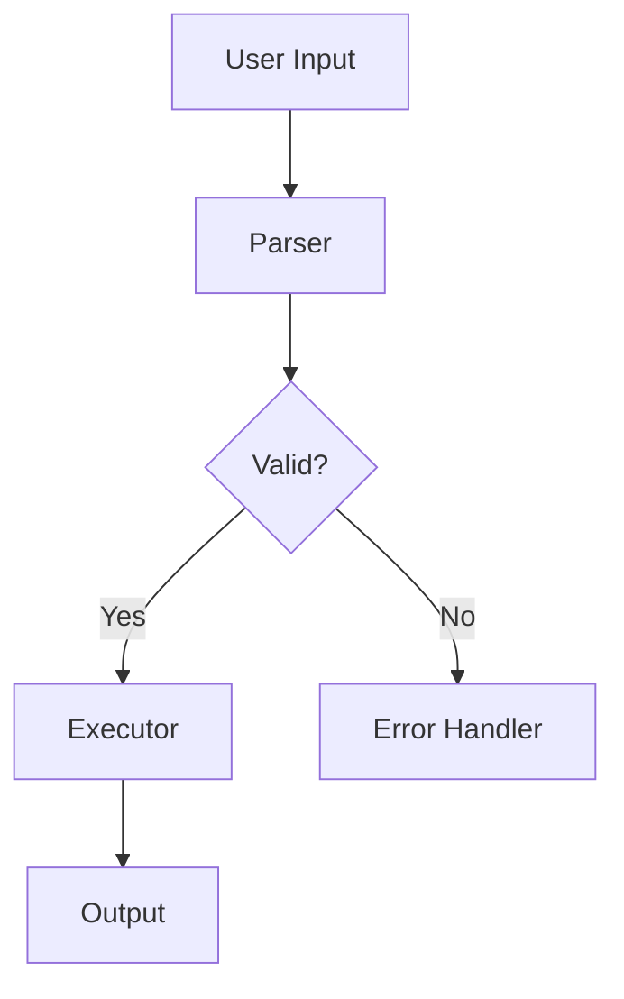

# Course Format Reference

This document is the authoritative specification for the opencourses course directory layout, all JSON schemas, section Markdown frontmatter, and all supported rich-content block types. All course content produced by the course-creation skill must conform to this spec.

---

## Directory Layout

```
<course-repo>/
  course.json                     # Course-level metadata (required)
  .gitignore                      # Must include scratch/ (required)
  chapters/
    01-<slug>/                    # Chapter directory, zero-padded order prefix
      chapter.json                # Chapter metadata (required)
      sections/
        01-<slug>.md              # Section content file, zero-padded order prefix
        02-<slug>.md
        ...
    02-<slug>/
      chapter.json
      sections/
        ...
  assets/                         # Images, Lottie JSONs, Excalidraw scene files
    .gitkeep                      # Ensure directory is tracked by Git
  scratch/                        # Gitignored learner work directory (not committed)
```

**Naming rules:**
- Chapter directory names: `NN-slug` where `NN` is a zero-padded two-digit integer matching `chapter.order` (e.g., `01-introduction`, `12-advanced-topics`).
- Section file names: `NN-slug.md` where `NN` is a zero-padded two-digit integer matching `section.order` (e.g., `01-installation.md`, `03-writing-tests.md`).
- Slugs are lowercase, hyphenated, and descriptive. No spaces, no uppercase, no special characters except hyphens.

---

## course.json Schema

Location: `<course-repo>/course.json`

```json
{
  "id": "string (UUID v4, generated at course creation time)",
  "title": "string (human-readable course title)",
  "description": "string (1-3 sentence course description)",
  "objective": "string (free-text learning objective, as provided by the creator)",
  "version": "string (semver, e.g. '1.0.0')",
  "sourceRepo": "string (GitHub URL of the repository the course is about)",
  "courseRepo": "string (GitHub URL of this course repository)",
  "registryEntry": {
    "title": "string (title as it appears in the public registry)",
    "description": "string (short registry description)",
    "tags": ["string"]
  },
  "createdAt": "string (ISO 8601 datetime, e.g. '2026-01-15T10:30:00Z')",
  "updatedAt": "string (ISO 8601 datetime)"
}
```

**Field notes:**
- `id`: Generate a valid UUID v4. Must be stable across updates (do not regenerate on update).
- `version`: Start at `"1.0.0"`. Increment on each published update.
- `sourceRepo`: The GitHub URL of the repo being taught, not this course repo.
- `courseRepo`: The GitHub URL of this repo (where course files live).
- `registryEntry.tags`: Lowercase, short, descriptive tags (e.g., `["typescript", "cli", "testing"]`).

---

## chapter.json Schema

Location: `<course-repo>/chapters/<NN-slug>/chapter.json`

```json
{
  "id": "string (UUID v4, generated at chapter creation time)",
  "title": "string (human-readable chapter title)",
  "description": "string (1-2 sentence summary of what this chapter covers)",
  "order": 1
}
```

**Field notes:**
- `id`: Generate a valid UUID v4. Must match the `id` in the `ChapterOutline`.
- `order`: 1-based integer. Must match the chapter's position in the course.

---

## Section Markdown Frontmatter

Every section file (`chapters/<NN-slug>/sections/<NN-slug>.md`) must begin with YAML frontmatter delimited by `---`.

```yaml
---
id: "3f7a1b2c-4d5e-6f7a-8b9c-0d1e2f3a4b5c"
title: "Parsing Configuration Files"
order: 2
hasTask: true
---
```

**Field notes:**
- `id`: UUID v4 string. Must match the `id` in the `SectionOutline`.
- `title`: Human-readable section title. Should match the outline.
- `order`: 1-based integer within the parent chapter.
- `hasTask`: Boolean. Must be `true` if the section contains a `:::task` block.

**The frontmatter must come before all body content.** No blank lines before the opening `---`.

---

## Section Body Content

After the frontmatter, write section content using standard Markdown with the following extensions.

### Standard Markdown

All standard Markdown is supported: headings (H2 and below — H1 is reserved for the section title rendered from frontmatter), paragraphs, bold/italic, inline code, fenced code blocks, lists, blockquotes, tables, links.

### Code Blocks

Use fenced code blocks with a language identifier:

````markdown
```typescript
function parseConfig(filePath: string): Config {
  const raw = fs.readFileSync(filePath, 'utf8');
  return JSON.parse(raw) as Config;
}
```
````

```bash
npm install --save-dev typescript
```

Supported language identifiers include: `typescript`, `javascript`, `go`, `rust`, `python`, `bash`, `sh`, `json`, `yaml`, `toml`, `sql`, `html`, `css`, and others.

---

## Mermaid Diagrams

Use a fenced code block with the `mermaid` language tag:

````markdown

````

**Supported diagram types:**
- `graph TD` / `graph LR` — flowcharts (top-down or left-right)
- `sequenceDiagram` — sequence/message flow diagrams
- `flowchart LR` / `flowchart TD` — explicit flowchart syntax
- `classDiagram` — class/type relationship diagrams
- `erDiagram` — entity-relationship diagrams

Use Mermaid to illustrate architecture, data flow, lifecycle states, or relationships between components. At least one Mermaid diagram is required per course.

---

## Task Blocks

Task blocks define a hands-on exercise the learner must complete before advancing. They are parsed by the app's `TaskBlockNode` renderer.

**Syntax:**

```
:::task
id: task-01
title: "Implement the parseConfig function"
objective: "Write a TypeScript function that reads a JSON config file and returns a typed Config object."
hints:
  - "Use fs.readFileSync with encoding 'utf8'"
  - "Use JSON.parse and cast to the Config type"
  - "Place your file at scratch/config.ts"
criteria:
  - "File config.ts exists in the scratch directory"
  - "Function parseConfig is exported from config.ts"
  - "parseConfig('config.json') returns an object with a 'name' field of type string"
:::
```

**Field spec:**

| Field | Type | Required | Description |
|---|---|---|---|
| `id` | string | Yes | Unique identifier for this task within the course (e.g., `task-01`, `ch2-task-01`). Kebab-case. |
| `title` | string | Yes | Short human-readable task title. |
| `objective` | string | Yes | 1-2 sentence description of what the learner must produce or demonstrate. |
| `hints` | string[] (YAML list) | No | 2-4 hints displayed progressively to the learner on request. |
| `criteria` | string[] (YAML list) | Yes | 1-5 measurable pass/fail criteria. Each criterion is a plain-English statement that the evaluation agent will assess. |

**Rules:**
- The `:::task` block must appear after all explanatory prose in the section.
- A section with `hasTask: true` in its frontmatter must contain exactly one `:::task` block.
- A section with `hasTask: false` must not contain a `:::task` block.
- Criteria must be specific and assessable by reading file contents or observing program output. Avoid vague criteria like "the code is clean".

---

## Lottie Animation Blocks

Use a `:::lottie` directive to embed a Lottie JSON animation from the `assets/` directory:

```
:::lottie
src: assets/loading-spinner.json
width: 200
height: 200
loop: true
autoplay: true
:::
```

**Field spec:**

| Field | Type | Required | Default | Description |
|---|---|---|---|---|
| `src` | string | Yes | — | Path to the Lottie JSON file, relative to the course repo root. |
| `width` | number | No | 300 | Display width in pixels. |
| `height` | number | No | 300 | Display height in pixels. |
| `loop` | boolean | No | true | Whether the animation loops. |
| `autoplay` | boolean | No | true | Whether the animation plays automatically. |

The Lottie JSON file must be present in the `assets/` directory and committed to the course repo.

---

## Excalidraw Diagram Blocks

Use a `:::excalidraw` directive to embed a read-only Excalidraw scene from the `assets/` directory:

```
:::excalidraw
src: assets/system-overview.excalidraw
:::
```

**Field spec:**

| Field | Type | Required | Description |
|---|---|---|---|
| `src` | string | Yes | Path to the `.excalidraw` scene file, relative to the course repo root. |

The `.excalidraw` file is a JSON file following the Excalidraw scene format. It must be present in `assets/` and committed to the course repo. The app renders it via the `ExcalidrawNode` in read-only (view) mode.

---

## .gitignore

The course repo must include a `.gitignore` at the root. At minimum it must contain:

```
scratch/
```

The `scratch/` directory is the learner's working directory. Its contents are never committed to the course repo.
